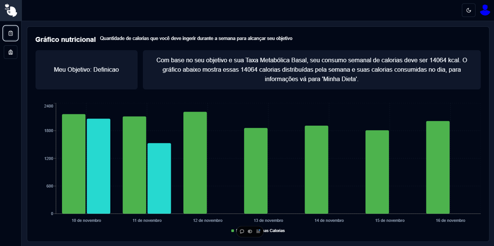

# [Nutri+](https://nutri-plus-xi.vercel.app)
[](https://nutri-plus-xi.vercel.app)

## Sobre ✏️
### A Nutri+ é uma aplicação criada para ajudar o usuário a monitorar seus dados nutricionais, mostrando seu IMC, Taxa Metabólica Basal e consumo de água. Além disso, com base nos dados fornecidos, é criado um gráfico que mostra como deve ser seu consumo diário de calorias com base no objetivo escolhido, e é permitido ao usuário colocar suas próprias calorias no gráfico a cada dia, assim, mostrando seu progresso diário.

## Tecnologias 💻
<div>
  <abbr title="React - Framework Javascript para desenvolvimento web" >
    
  </abbr>
  <abbr title="Next.js - Framework Javascript para desenvolvimento com React" >
    
  </abbr>
  <abbr title="Typescript - Linguagem fortemente tipada">
    
  </abbr>
</div>

## Bibliotecas 📚
<div>
  <abbr title="Shadcn - Biblioteca de design system">
    
  </abbr>
  <abbr title="Lucide - Biblioteca de ícones">
    
  </abbr>
  <abbr title="Tailwind CSS - Biblioteca de estilização css">
    
  </abbr>
  <abbr title="Zod - Biblioteca para validação de dados">
    
  </abbr>
  <abbr title="React Hook Form - Biblioteca para validação de formulário" >
    
  </abbr>
</div>

## Estrutura principal do Projeto 🗃️
```plaintext
┌── app/
│   └── ...
├── assets/
│   └── ...
├── components/
│   └── ...
├── data/
│   └── ...
├── hooks/
│   ├── state
│   │   └── ...
│   └── ...
├── lib/
│   └── ...
├── types/
│   └── ...
├── utils/
│   └── ...
└── ...
```
### Descrição:
- app - Contém as páginas da aplicação;
- assets - Contém os arquivos de imagem;
- components - Contém os componentes usados na aplicação;
- data - Contém os dados estáticos usados na aplicação;
- hooks - Contém os hooks e, dentro de state, os estados globais usados para gerenciar a aplicação;
- lib - Pasta criada pela biblioteca Shadcn;
- types - Contém as tipagens de dados da aplicação;
- utils - Contém as funções frequentemente usadas;

## Rodando Localmente (Prompt) 📟
### Clone o projeto
```bash
  git clone https://github.com/Paulo-Mikhael/nutri-plus-dashboard
```
### Entre no diretório do projeto
```bash
  cd nutri-plus-dashboard
```
### Instale as dependências
```bash
  npm install
```
### Inicie o servidor
```bash
  npm run dev
```

## Talvez você queira ver 💡
  ### [Portifólio](https://portifolio-react-three.vercel.app/)
  ### [Currículo](https://docs.google.com/document/d/1xhimUtV6EM7c1GtwBwAHsIonX1HjoLSi/edit)

## Confira meus outros projetos 🛠️
  - [PHLOX Blog - Blog de uma empresa de tecnologia](https://github.com/Paulo-Mikhael/phlox-blog?tab=readme-ov-file#readme)
  - [in.orbit (back-end) - API de metas](https://github.com/Paulo-Mikhael/in-orbit-backend?tab=readme-ov-file#readme)
  - [Fastask - Gerenciador de Tarefas](https://github.com/Paulo-Mikhael/fastask?tab=readme-ov-file#readme)
  - [in.orbit (front-end) - Aplicação de metas pessoais](https://github.com/Paulo-Mikhael/in-orbit-frontend?tab=readme-ov-file#readme)
  - [Landing Page para uma academia](https://github.com/Paulo-Mikhael/academia-landing-page?tab=readme-ov-file#readme)
  - [Landing Page para um e-commerce de plantas](https://github.com/Paulo-Mikhael/casa-verde?tab=readme-ov-file#readme)

## Contatos 📞
  [](https://portifolio-react-three.vercel.app/contacts)
  [](https://www.linkedin.com/in/paulo-miguel-4b706022b/)
  [](https://www.instagram.com/pa__miguel?igsh=MWxoYzdqNGluZWcyaA%3D%3D)
  [](https://api.whatsapp.com/send/?phone=5592992813253&text=Ol%C3%A1%21+Gostaria+de+fazer+uma+oferta...&type=phone_number&app_absent=0)